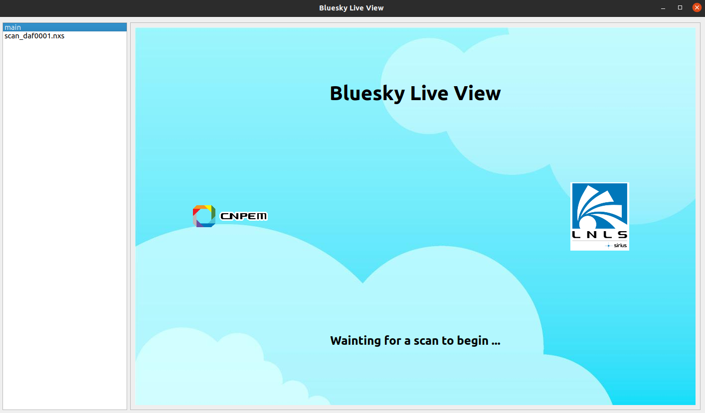
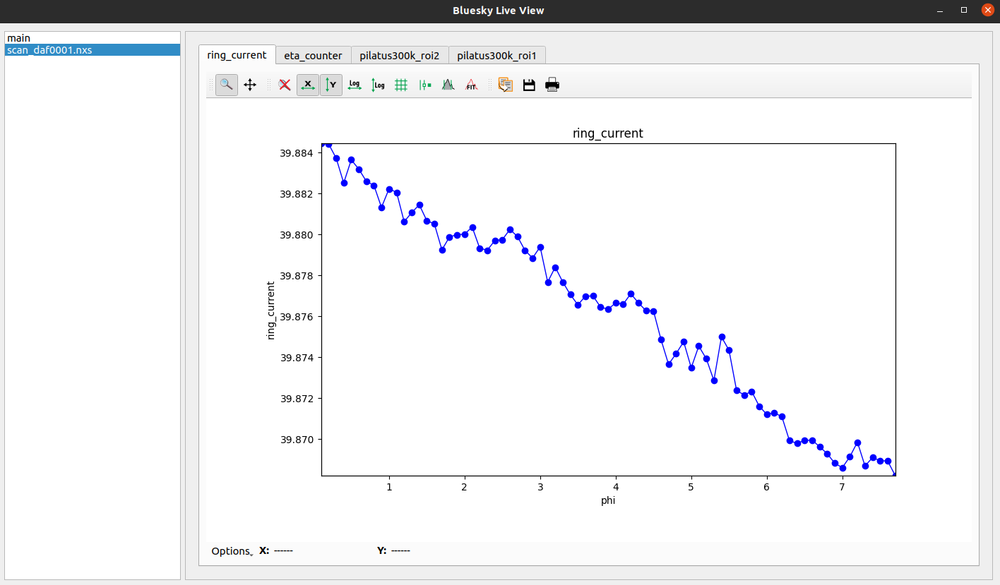

# This is a live view for data produced by Bluesky in the so called "Documents" and streamed via [Kafka](https://kafka.apache.org/).



## In order to use it, you'll need to have an acessible Kafka Topic that you can publish your data. You will need to deploy Kafka in your PC and create this topic. If you are running this from a beamline configured GUI, the topic is probably already create and will be called <BL>_bluesky, (EMA_bluesky for instance). There a really easy-to-follow tutorial about Kafka [Here](https://kafka.apache.org/quickstart).

## After setting up Kafka and the topic that you will stream to, you will need a callback to subscribe to RunEngine and stream the run generated Documents, it is a simple callback:

```
from kafka import KafkaProducer
import msgpack

producer = KafkaProducer()

def kafka_callback(name: str, doc: dict) -> None:
    """Callback to stream Bluesky Documents via Kafka"""
    producer = KafkaProducer(value_serializer=msgpack.dumps)
    producer.send(<kafkja_topic>, (name, doc))
```

## Notice that you will need to install kafka-python and msgpack.

## After the definition of the callback, subscribe it to Bluesky RunEngine:

```
from bluesky import RunEngine

RE = RunEngine()
kafka_callback_token = RE.subscribe(kafka_callback)
```

## With this done, you can now launch kafka-bluesky-live, start a the run and see the data being plotted live.



### First, install this project:
```
pip install kafka-bluesky-live
```

### Then, run the in the terminal, run the following command:
```
kbl <kafka_topic_name>
```

### With the interface already opened, start a run in Bluesky to see it being plotted live.

## There are some special information that can be passed to kafka-bluesky-live via scan metadata that will change some of its behaviours. You can choose what scan motor that will be in the x-axis, set the counter that is going to be shown in the first tab and set the name that will identify the current run. This is all done by the special metada, they are: "file_name", "main_motor" and "main_counter".

### To input then to the current run you must add them as a metadata for that run, there are several ways that this can be done, for example defining a dict and inputing it to the RunEngine afterwards:
```
md = {"file_name": "my_awesome_file", "main_motor": "motor2", "main_counter": "counter_5"}
RunEngine(scan([counter_1, counter_2, counter_5], motor1, -1, 1, motor2, -5, 5, 100), **md)
```
